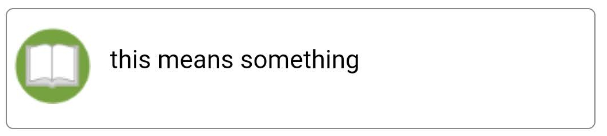
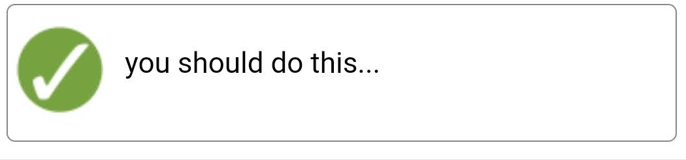
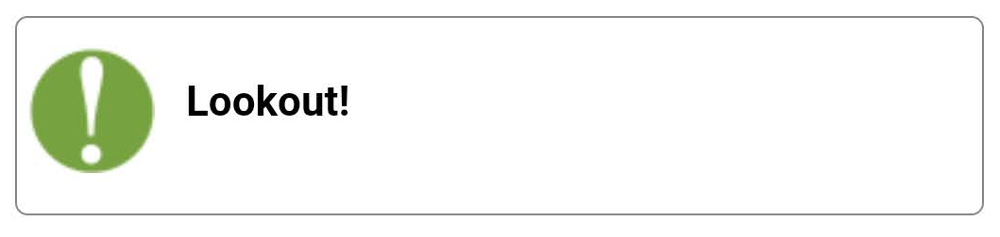
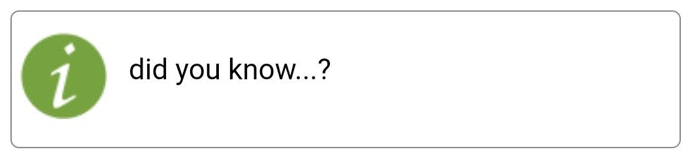
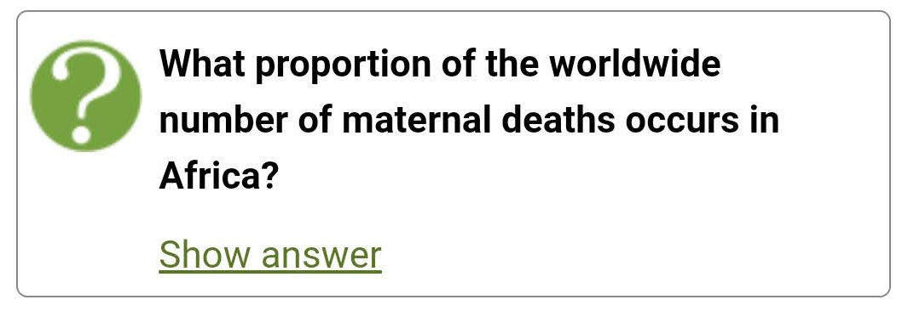
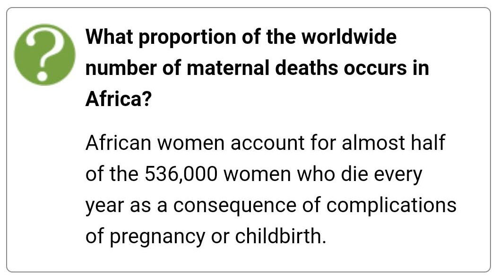

Course Design and Custom Styles
=================================

You can apply custom design/styles to you course content by creating a specific
stylesheet for your course (:ref:`styles`).

The styles can either override a default display style (e.g. for H1, H2 etc). 
Or you can add custom styles, in which case you will need to edit the HTML in 
the Moodle activity.

.. _styles-default: 

Default Styles provided by ``default.css``
------------------------------------------

Definition
~~~~~~~~~~~

HTML::

	

	    
this means something

	

Display

Action
~~~~~~~

HTML::

	

	    
you should do this...

	

Display

Warning
~~~~~~~~

HTML::

	

	    
Lookout!

	

Display

Info
~~~~~~~~~~~~~~~~

HTML::

	

	    
did you know...?

	

Display

	
Question
~~~~~~~~~

HTML::

	

	    
What proportion of the worldwide number of maternal deaths occurs in Africa?

	    
Show answer

	    

	        
African women account for almost half of the 536,000 women who die every year as a consequence of complications of pregnancy or childbirth.

	    

	

Display

