NooraHealth Style
====================

Permissions
------------

For editing content in Moodle, you will need and account with teacher permissions - accounts and permissions for this
need to be requested from Digital Campus.

For publishing and updating courses to the Oppia server, you will need permissions for this (the Noora team have admin
accounts to enable these permissions), see: :doc:`/implementers/dashboard/users`

Terminology
------------

A 'module' for NooraHealth is equivalent to a 'course' in Moodle.
A 'lesson' for NooraHealth is equivalent to a 'topic' in Moodle.

Applying the styles
-----------------------

For this style, the page content in Moodle needs to be edited/updated when using the HTML code view, these styles can't
be applied only using the WYSIWYG editor view.

To access the HTML code view, first click on the editor icon in the top left:

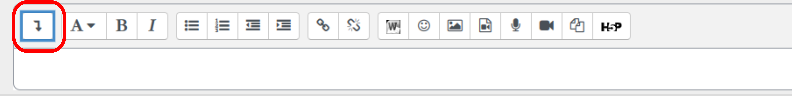

Then click on the code view icon in the bottom right:

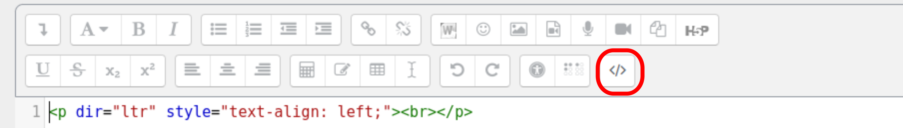

Intro Section
~~~~~~~~~~~~~~

Example:: 

    <intro-section>
        
        <content>
            <module-title>MODULE 1:</module-title>
            <module-description>Getting started with the Care Companion Program</module-description>
            <lesson-title>LESSON 1:</lesson-title>
            <lesson-description>Setting Context</lesson-description>
        </content>
    </intro-section>

Example output:

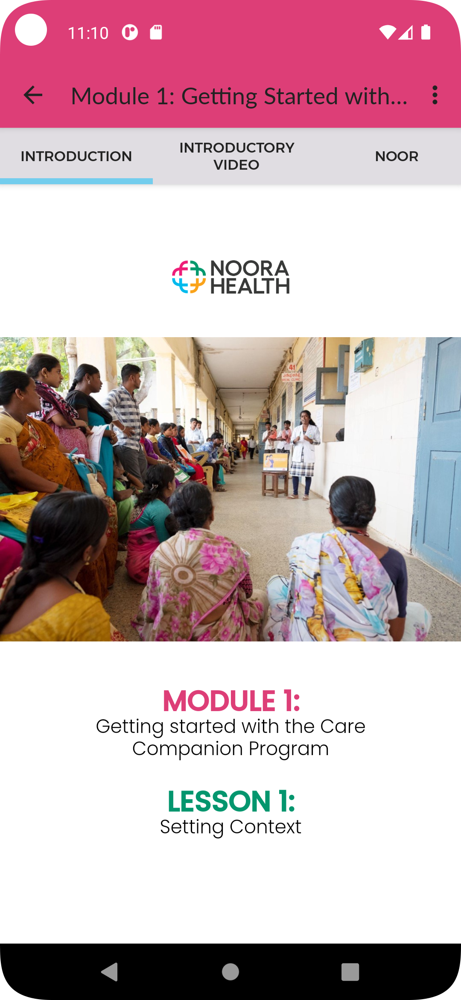

Video Section
~~~~~~~~~~~~~~

Example::

    <video-section>
        <video poster="video.png" controls="true">
            <source src="video.mp4">video.mp4
        </video>
    </video-section>

Example output:

    
    
Noor Section
~~~~~~~~~~~~~~

Example::

    <noor-section>
        <slide>
            <noor icon="1"></noor>
            
Hello, my name is <strong><em>‘Noor’</em></strong>. I am excited to be here with you today.

        </slide>
        <slide>
            <noor icon="1"></noor>
            
I am your online assistant, and I will guide you through this program

        </slide>
        <slide>
            <noor icon="2"></noor>
            
Through these modules, I will take you through a step by step process of becoming a CCP Trainer.

        </slide>
    </noor-section>

Example output:

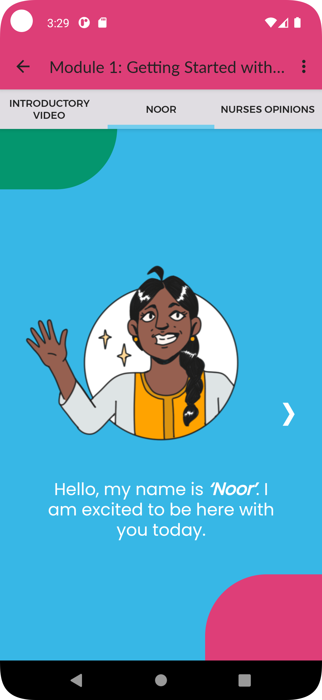
    
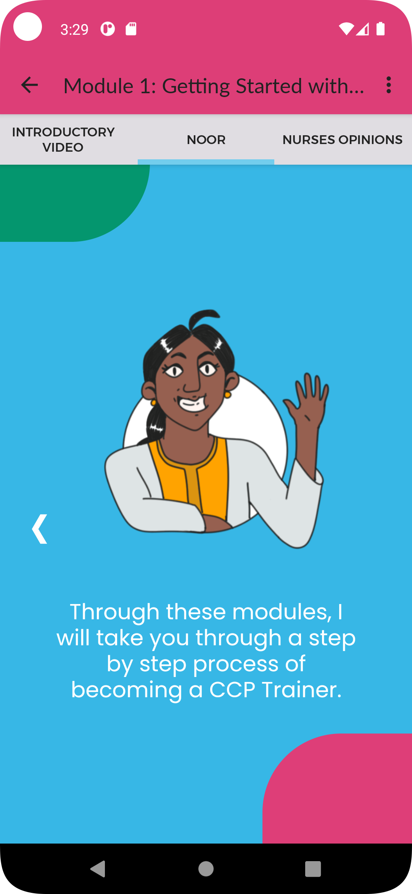
    
Content Section
~~~~~~~~~~~~~~~~

Example::

    <content-section pagination="true">
        <slide>
            
            
Nurse Bhakti has been working in the neo-natal ward at SNR District Hospital, Kolar for more than a decade. As a senior nurse, she has many responsibilities— meeting patients, talking to their families, administering medicine, doing rounds with the doctor and maintaining the records.

        </slide>
        <slide>
            
            
One day during her rounds, she met a one-week old baby who had been admitted to the ward. The baby was constantly crying.

            
When nurse Bhakti asked the mother what the problem was, she was told that the mother had been facing difficulties in breastfeeding the baby since a couple
                of days.

        </slide>
        <slide>
            
            
An elderly neighbor had suggested the family to give the baby some baby food mixed with water. The worried parents had followed this advice, but the baby developed loose stools, refused to eat, and wouldn't stop crying.
                The family was concerned. They rushed to mother and baby to the district hospital.
            

        </slide>
        <slide>
            
            
The doctor immediately admitted the baby and asked the mother to exclusively breastfeed the child. But the mother was still experiencing pain while feeding the baby and did not know what to do.
                Nurse Bhakti noticed that the mother was scared. She told her not to worry and showed her the correct breastfeeding techniques.The frightened young mother and her family followed all of Nurse Bhakti’s instructions.
            

        </slide>
        <slide>
            
            
Over the next few days, Nurse Bhakti kept checking if the mother was following her instructions. She also made sure that the mother was eating nutritious and well-balanced meals. With the mother following the right breastfeeding techniques, the baby’s health improved. 

    
            
The mother and the family were grateful to Bhakti for her efforts.

        </slide>  
    </content-section>

Example output:

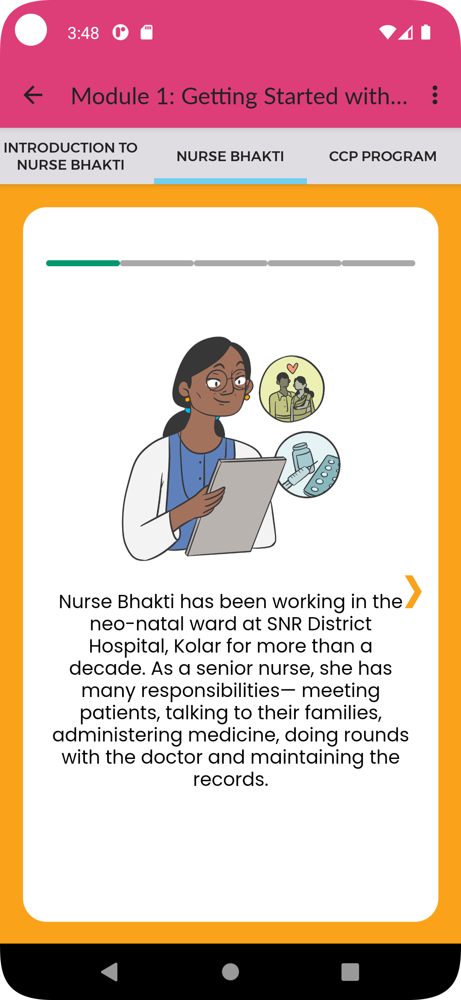
    
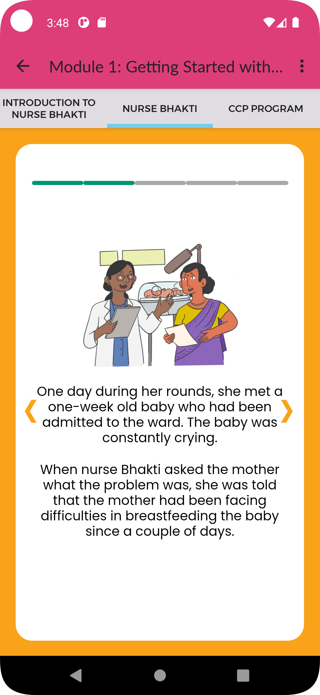

Info Section
~~~~~~~~~~~~~~~~

Example::

    <info-section>
        <slide>
            
            
Nurse Bhakti's story is not unique.

            
As a nurse, you are the main person of contact for patients and families. You go above and beyond your duty for many patients.

        </slide>
        <slide>
            
            
With CCP, the responsibility of patient care is shared between doctors, nurses, and families/caregivers.

        </slide>
        <slide>
            
            
Noora Health has trained over 12,00,000 nurses in different parts of the country.

    
            
The Care Companion Program has impacted nearly 57,00,000 families to be able to take care of their health. 

        </slide>
        <slide>
            
            
As a CCP Trainer, you will also join this journey and create a difference in the lives of many patients and their families.

    
            
You are not alone in this journey

            
<strong>Noora Health is here to support you throughout.</strong>

        </slide>
    </info-section>

Example output:

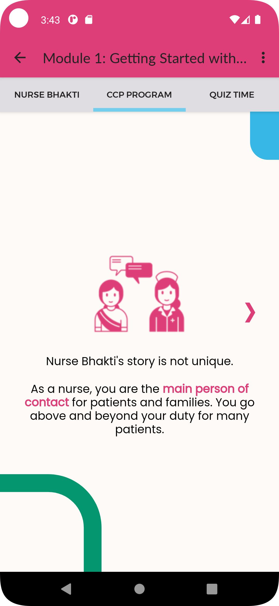
    
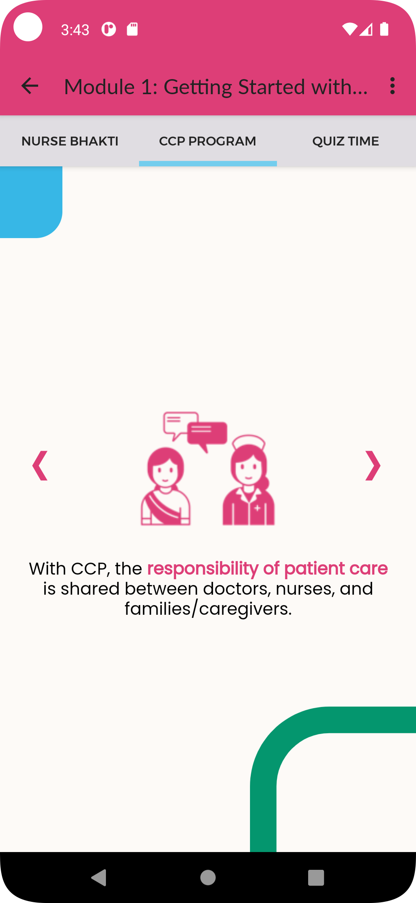

What we learned Section
~~~~~~~~~~~~~~~~~~~~~~~~~~~~~~~~

Example::

    <what-we-learned-section>
        <section-title>What we learned in this lesson</section-title>
    
        <card left="" color="orange">
            <content>
                
                
As nurses, you spend a significant amount of time with patients, who look up to you for advice and guidance.

            </content>
        </card>
    
        <card right="" color="pink">
            <content>
                
                
By sharing accurate medical information with patients and their families, you engage them, transforming the patient's health into a shared responsibility.
                

            </content>
        </card>
    </what-we-learned-section>

Example output:

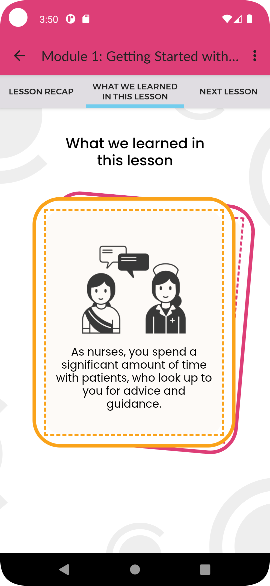
    
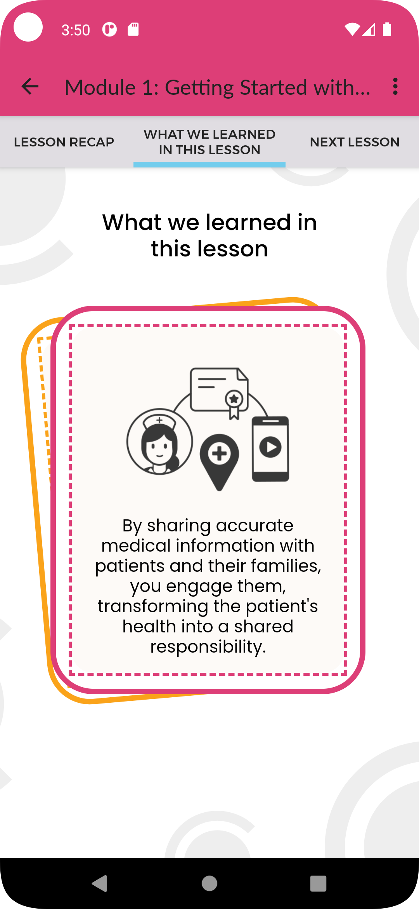

Next Lesson Section
~~~~~~~~~~~~~~~~~~~~~~~~~~~~~~~~

Example::

    <next-lesson-section>
        In the next lesson we will talk about how the <strong>Care Companion program</strong> plays a role in shared caregiving.
    </next-lesson-section>

Example output:

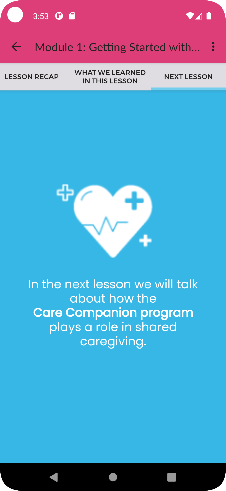
    
    
Quizzes and Feedback
----------------------

The overall style for quizzes is defined directly in the app, so can't be changed within Moodle.

For the feedback responses, you can use the following styles:

For correct response::

    <feedback-result>
        <feedback-card color="green">
            <content>
                <h1 color="green">Success!</h1>
                <answer>“Giving medical information to patients and families”</answer>
                
The purpose of a CCP session is to provide accurate medical information and skills to take care of the patient.

            </content>
        </feedback-card>
    
    </feedback-result>
    
For incorrect response::

    <feedback-result>
        <feedback-card color="pink">
            <content>
                <h1 color="pink">Oh no!</h1>
                
The correct answer is:

                <answer>“Giving medical information to patients and families”</answer>
                
The purpose of a CCP session is to provide accurate medical information and skills to take care of the patient.
  
            </content>
        </feedback-card>
    </feedback-result>

For multiple choice questions, where there is only one correct answer, enter the feedback into the feedback field
corresponding to the response option.

For multiple select questions, where there is more than one correct answer, enter the feedback in the 'combined
feedback' section, either the "For any correct response" or "For any incorrect response" fields. The correct response
feedback is given to the user if they get the question 100% correct, otherwise they will get the incorrect response
feedback.

