NooraHealth Style
====================

Permissions
------------

For editing content in Moodle, you will need and account with teacher permissions - accounts and permissions for this
need to be requested from Digital Campus.

For publishing and updating courses to the Oppia server, you will need permissions for this (the Noora team have admin
accounts to enable these permissions), see: :doc:`/implementers/dashboard/users`

Terminology
------------

A 'module' for NooraHealth is equivalent to a 'course' in Moodle.
A 'lesson' for NooraHealth is equivalent to a 'topic' in Moodle.

Applying the styles
-----------------------

For this style, the page content in Moodle needs to be edited/updated when using the HTML code view, these styles can't
be applied only using the WYSIWYG editor view.

To access the HTML code view, first click on the editor icon in the top left:

.. image:: images/moodle-html1.png
    :width: 400 px

Then click on the code view icon in the bottom right:

.. image:: images/moodle-html2.png
    :width: 400 px

Intro Section
~~~~~~~~~~~~~~

Example:: 

    <intro-section>
        
        <content>
            <module-title>MODULE 1:</module-title>
            <module-description>Getting started with the Care Companion Program</module-description>
            <lesson-title>LESSON 1:</lesson-title>
            <lesson-description>Setting Context</lesson-description>
        </content>
    </intro-section>

Example output:

.. image:: images/intro-section.png
    :width: 200 px

Video Section
~~~~~~~~~~~~~~

Example::

    <video-section>
        <video poster="video.png" controls="true">
            <source src="video.mp4">video.mp4
        </video>
    </video-section>

.. note::
   *video.png* must be replaced by the full path of the thumbnail image.

   *video.mp4* must be replaced by the full path of the video file.

Example output:

.. image:: images/video-section.png
    :width: 200 px

Audio Section
~~~~~~~~~~~~~~

Example::

    <audio-section>
        <content>
            
<strong>Play the audio to hear Roopa’s story.</strong>

            <!-- The next line is optional, only when you want to add an image above the audio player -->
            

            <audio controls="true">
                <source src="audio.mp3">audio.mp3
            </audio>
        </content>
    </audio-section>

.. note::
   *audio.png* must be replaced by the full path of the image that will display above the audio player.

   *audio.mp3* must be replaced by the full path of the audio file.

Example output:

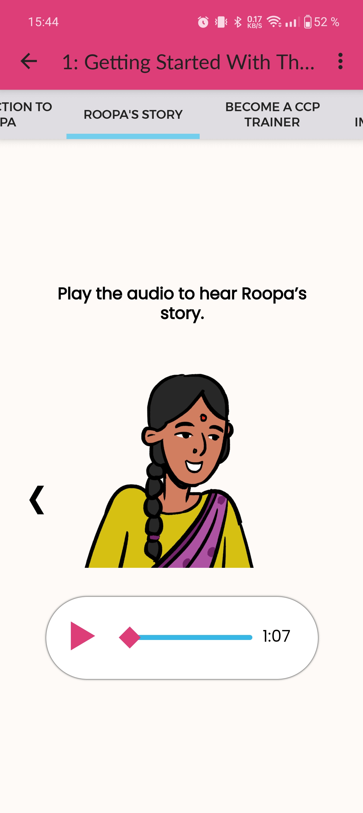
    
    
Noor Section
~~~~~~~~~~~~~~

Example::

    <noor-section>
        <slide>
            <noor icon="1"></noor>
            
Hello, my name is <strong><em>‘Noor’</em></strong>. I am excited to be here with you today.

        </slide>
        <slide>
            <noor icon="1"></noor>
            
I am your online assistant, and I will guide you through this program

        </slide>
        <slide>
            <noor icon="2"></noor>
            
Through these modules, I will take you through a step by step process of becoming a CCP Trainer.

        </slide>
    </noor-section>

Example output:

.. image:: images/noor-section-1.png
    :width: 200 px  
    
.. image:: images/noor-section-3.png
    :width: 200 px 
    
Content Section
~~~~~~~~~~~~~~~~

Example::

    <content-section pagination="true">
        <slide>
            
            
Nurse Bhakti has been working in the neo-natal ward at SNR District Hospital, Kolar for more than a decade. As a senior nurse, she has many responsibilities— meeting patients, talking to their families, administering medicine, doing rounds with the doctor and maintaining the records.

        </slide>
        <slide>
            
            
One day during her rounds, she met a one-week old baby who had been admitted to the ward. The baby was constantly crying.

            
When nurse Bhakti asked the mother what the problem was, she was told that the mother had been facing difficulties in breastfeeding the baby since a couple
                of days.

        </slide>
        <slide>
            
            
An elderly neighbor had suggested the family to give the baby some baby food mixed with water. The worried parents had followed this advice, but the baby developed loose stools, refused to eat, and wouldn't stop crying.
                The family was concerned. They rushed to mother and baby to the district hospital.
            

        </slide>
        <slide>
            
            
The doctor immediately admitted the baby and asked the mother to exclusively breastfeed the child. But the mother was still experiencing pain while feeding the baby and did not know what to do.
                Nurse Bhakti noticed that the mother was scared. She told her not to worry and showed her the correct breastfeeding techniques.The frightened young mother and her family followed all of Nurse Bhakti’s instructions.
            

        </slide>
        <slide>
            
            
Over the next few days, Nurse Bhakti kept checking if the mother was following her instructions. She also made sure that the mother was eating nutritious and well-balanced meals. With the mother following the right breastfeeding techniques, the baby’s health improved. 

    
            
The mother and the family were grateful to Bhakti for her efforts.

        </slide>  
    </content-section>

Example output:

.. image:: images/content-section-1.png
    :width: 200 px  
    
.. image:: images/content-section-2.png
    :width: 200 px 

Feedback Section
~~~~~~~~~~~~~~~~

Example::

    <info-section type="feedback">
        <content>
            
Over the last couple of months, I have spoken to a few nurses from different parts of the world

            
<strong>Here is what they said:</strong>

            <noora-button color="green"><em>“I spend a lot of time talking to patients and their families about how to care take of themselves better.”</em></noora-button> 
            <noora-button color="green"><em>“I feel patients and their families respect me because of my uniform and my knowledge.”</em></noora-button> 
            <noora-button color="green"><em>“Apart from taking care of patients many times I also provide emotional support to patients and their families”</em>. </noora-button> 
            
<strong>Tap on the statement which you agree with the most</strong>

    
        </content>
    </info-section>

Example output:

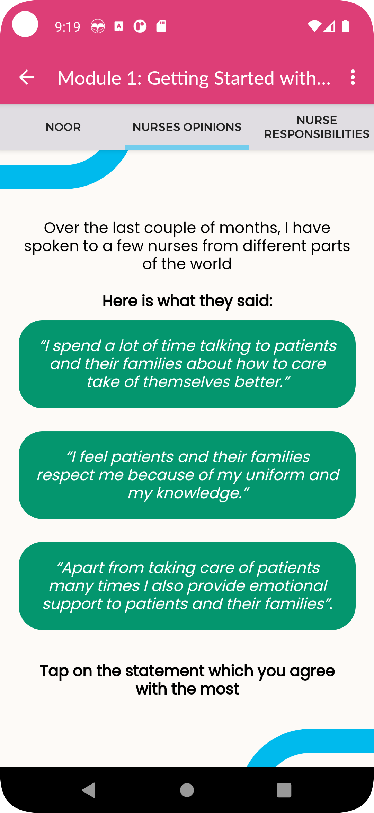

Info Section
~~~~~~~~~~~~~~~~

Example::

    <info-section>
        <slide>
            
            
Nurse Bhakti's story is not unique.

            
As a nurse, you are the main person of contact for patients and families. You go above and beyond your duty for many patients.

        </slide>
        <slide>
            
            
With CCP, the responsibility of patient care is shared between doctors, nurses, and families/caregivers.

        </slide>
        <slide>
            
            
Noora Health has trained over 12,00,000 nurses in different parts of the country.

    
            
The Care Companion Program has impacted nearly 57,00,000 families to be able to take care of their health. 

        </slide>
        <slide>
            
            
As a CCP Trainer, you will also join this journey and create a difference in the lives of many patients and their families.

    
            
You are not alone in this journey

            
<strong>Noora Health is here to support you throughout.</strong>

        </slide>
    </info-section>

Example output:

.. image:: images/info-section-1.png
    :width: 200 px  
    
.. image:: images/info-section-2.png
    :width: 200 px

.. note::
   Using ``<info-section type="specify-the-type-here">`` you can get different background variations of the info section. The allowed values are: 1, 2, 3, 4, gallery, and feedback. And the result are the following:

   +-----------------------------------------+-----------------------------------------+-----------------------------------------+
   | .. figure:: images/info-section-1.png   | .. figure:: images/info-section-3.png   | .. figure:: images/info-section-4.png   |
   |   :width: 100%                          |   :width: 100%                          |   :width: 100%                          |
   |                                         |                                         |                                         |
   |   type="1"                              |   type="2"                              |   type="3"                              |
   +-----------------------------------------+-----------------------------------------+-----------------------------------------+
   | .. figure:: images/info-section-5.png   | .. figure:: images/info-section-6.png   | .. figure:: images/info-section-7.png   |
   |   :width: 100%                          |   :width: 100%                          |   :width: 100%                          |
   |                                         |                                         |                                         |
   |   type="4"                              |   type="gallery"                        |   type="feedback"                       |
   +-----------------------------------------+-----------------------------------------+-----------------------------------------+

What we learned Section
~~~~~~~~~~~~~~~~~~~~~~~~~~~~~~~~

Example::

    <what-we-learned-section>
        <section-title>What we learned in this lesson</section-title>
    
        <card left="" color="orange">
            <content>
                
                
As nurses, you spend a significant amount of time with patients, who look up to you for advice and guidance.

            </content>
        </card>
    
        <card right="" color="pink">
            <content>
                
                
By sharing accurate medical information with patients and their families, you engage them, transforming the patient's health into a shared responsibility.
                

            </content>
        </card>
    </what-we-learned-section>

Example output:

.. image:: images/what-we-learned-section-1.png
    :width: 200 px  
    
.. image:: images/what-we-learned-section-2.png
    :width: 200 px 

Next Lesson Section
~~~~~~~~~~~~~~~~~~~~~~~~~~~~~~~~

Example::

    <next-lesson-section>
        
        In the next lesson we will talk about how the <strong>Care Companion program</strong> plays a role in shared caregiving.
    </next-lesson-section>

Example output:

.. image:: images/next-lesson-section.png
    :width: 200 px  
    
 
Index Section
~~~~~~~~~~~~~~~~~~~~~~~~~~~~~~~~

Example::

    <index-section>
        <content>
            
When we talk of the care companion model, it has three parts to it:

            <item order="1">
                The Care Companion Program sessions.
            </item>
            <item order="2">
                Mobile Care Companion Service (MCCS)
            </item>
            <item order="3">
                Implementation Support
            </item>
        </content>
    </index-section>

Example output:

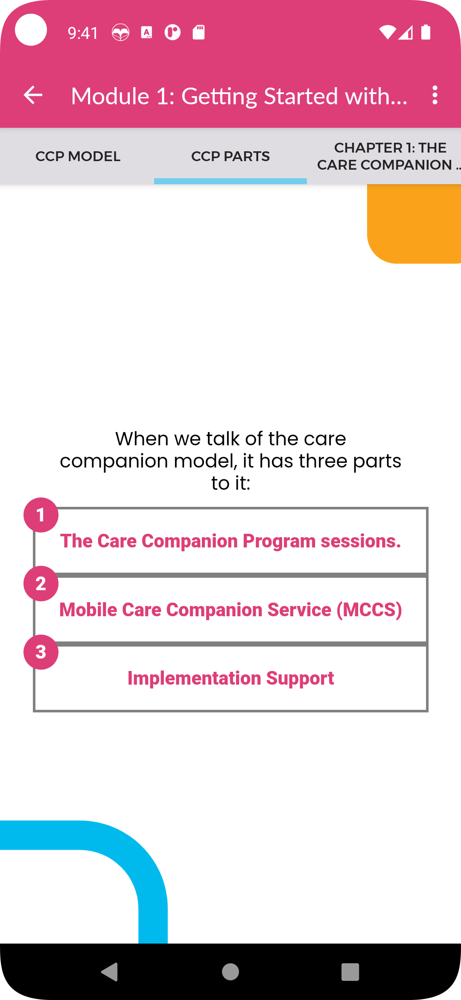

Chapter Section
~~~~~~~~~~~~~~~~~~~~~~~~~~~~~~~~

Example::

    <chapter-section>
        <content>
            
Chapter 1: <strong>The Care Companion Program (CCP) sessions</strong>

            
        </content>
    </chapter-section>

Example output:

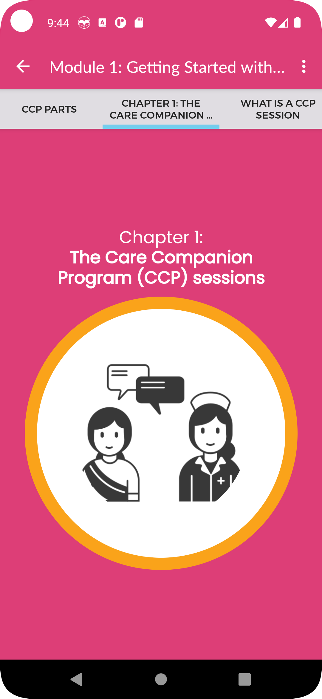

Know Mode Slides
~~~~~~~~~~~~~~~~~~~~~~~~~~~~~~~~

Example::

    <info-section>
        <slide>
            
Let us quickly see some of the <strong>impact</strong> in different health conditions.

        </slide>
        <slide>
            

                    Click on each disease area to know about the impact in each of the conditions.
            

            <small>Click the highlighted button to know more.</small>
            <know-more color="pink">
                <item highlighted="">
                    Cardiac Health
                    <modal>
                        <card-content>
                            For Cardiac Patients, 71% reduction in 30 day post surgical complications.
                        </card-content>
                    </modal>
                </item>
                <item>
                     Maternal and Child Health
                    <modal>
                        <card-content>
                            For Maternal and newborns, 56% Reduction in newborn readmissions and 18% reduction in newborn mortality.
                        </card-content>
                    </modal>
                </item>
                <item>
                    During Covid
                    <modal>
                        <card-content>
                            During Covid 19, 48% reduction in hospitalization
                        </card-content>
                    </modal>
                </item>
            </know-more>
        </slide>
    </info-section>

.. note::
   You can change the color using ``<know-more color="pink">`` and the color of your choice between: pink, blue, orange or green.

   If no color is specified, pink will be used.

Example output:

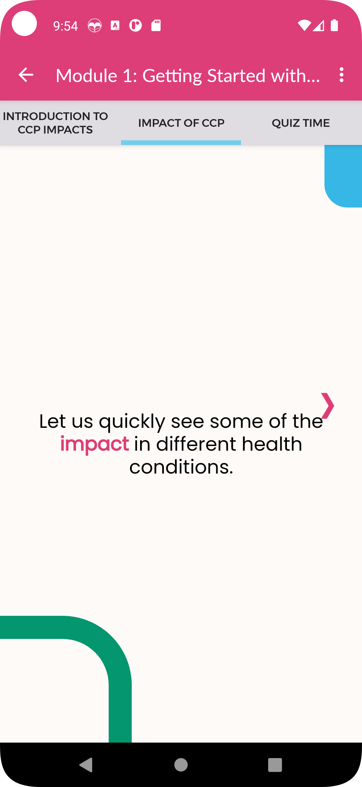

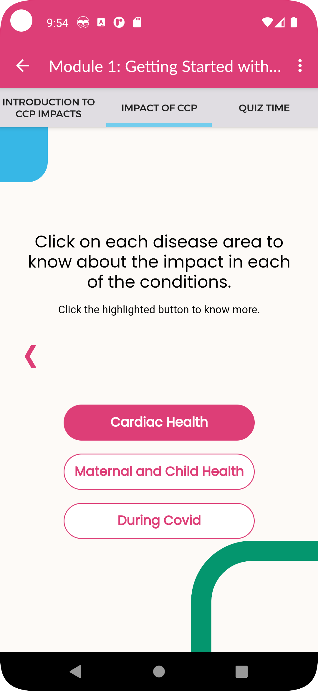
    
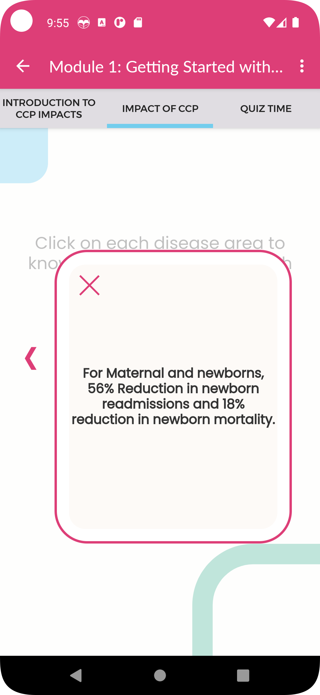

Content Image Grid
~~~~~~~~~~~~~~~~~~~~~~~~~~~~~~~~

Example::

    <content-section color="black">
        <content>
            
<strong>Think of places where -</strong>

            

                

                    
                    A group of patients can sit.
                

                

                    
                    You can easily
                    display the CCP tools
                

            

            

                

                    
                    You can display the posters provided for CCP sessions.
                

                

                    
                    Gathering patients and family members is convenient
                

            

        </content>
    </content-section>

Example output:

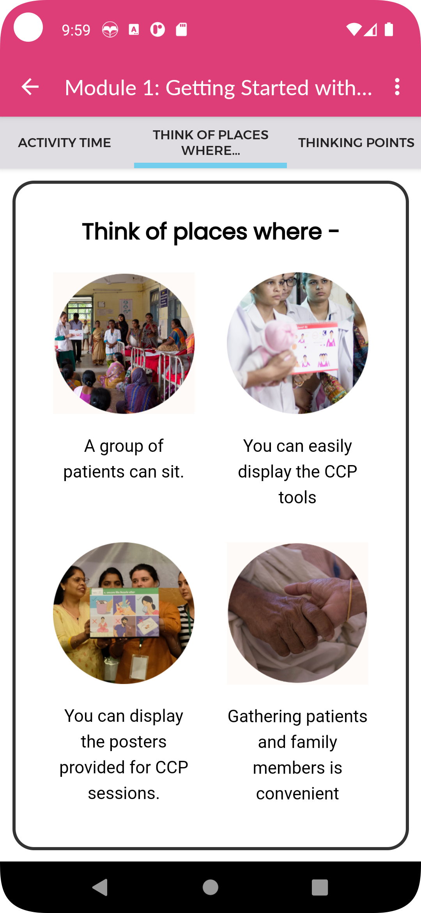

Content Card
~~~~~~~~~~~~~~~~~~~~~~~~~~~~~~~~

Example::

    <info-section>
        <content>
            <know-more class="columns">
                

                    <item highlighted="">
                        
                        <modal color="blue">
                            <card-content>
                                
                                <h1>Who is a Master Trainer?</h1>
                                A master trainer is a nurse nominated by the facility.
                                The selected nurse attends the in-person training conducted by the Noora Health training team.
                                The master trainer learns about conducting a CCP session and how to support the other nurses in the hospital to conduct these sessions.
                            </card-content>
                        </modal>
                    </item>
                    Master Trainer
                

                

                    <item>
                        
                        <modal color="blue">
                            <card-content>
                                
                                <h1>Who is a CCP Trainer?</h1>
                                All the nurses, such as you, in the facility attend the online training module and learns how to conduct CCP sessions.
                                After completing the training, you qualify as a CCP trainers.
                            </card-content>
                        </modal>
                    </item>
                    Trainer
                

            </know-more>
            
Click on each role to know more about them and their roles and responsabilities.<small> 
                    Click the highlighted button to know more.</small>

        </content>
    </info-section>

Example output:

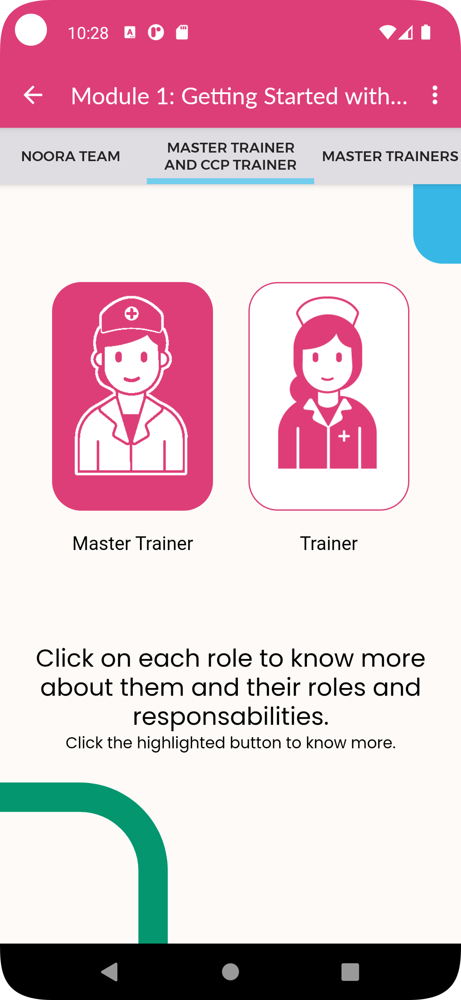
    
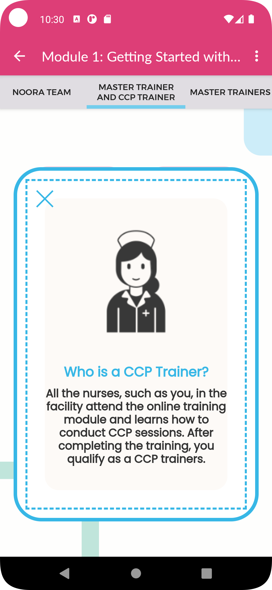
    
Quizzes and Feedback
----------------------

The overall style for quizzes is defined directly in the app, so can't be changed within Moodle.

For the feedback responses, you have to add the following styles under the "Feedback" field under each Moodle answer (using the HTML code view):

For correct response::

    <feedback-result>
        <feedback-card color="green">
            <content>
                <h1 color="green">Success!</h1>
                <answer>"Giving medical information to patients and families"</answer>
                
The purpose of a CCP session is to provide accurate medical information and skills to take care of the patient.

                
During the CCP session you will not just be sharing information but also interacting with participants to ensure that they understand what you are saying.

                
The patients will be able to use the information when they go home.

            </content>
        </feedback-card>
    </feedback-result>
    
Example output:

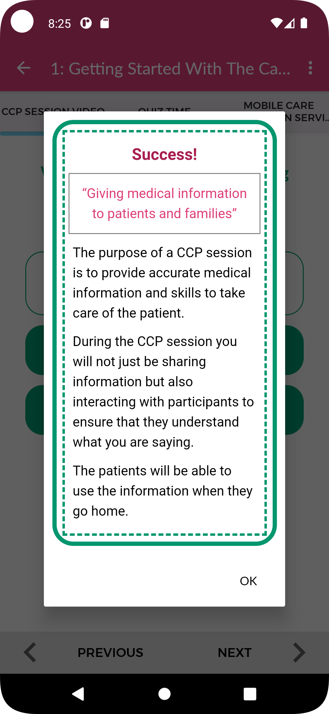
    
For incorrect response::

    <feedback-result>
        <feedback-card color="pink">
            <content>
                <h1 color="pink">Oh no!</h1>
                
The correct answer is:

                <answer>
                    <table style="text-align: center;">
                        <tbody>
                            <tr>
                                <td style="text-align: center;"></td>
                                <td style="text-align: center;"></td>
                                <td style="text-align: center;"></td>
                            </tr>
                            <tr>
                                <td style="text-align: center;">Patients &amp; family members</td>
                                <td style="text-align: center;">Nurse</td>
                                <td style="text-align: center;">Visual Aids like Flipcharts</td>
                            </tr>
                        </tbody>
                    </table>
                </answer>
                
A CCP session is conducted by the nurse using visual aids such as flipcharts, models, charts, etc.

                
These visual aids are used to help people relate to the material being taught,<strong> promoting better understanding, and improving retention.</strong>

            </content>
        </feedback-card>
    
Example output:

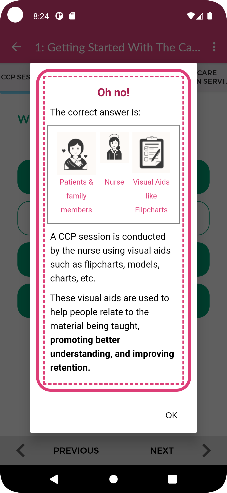

For multiple choice questions, where there is only one correct answer, enter the feedback into the feedback field
corresponding to the response option.

For multiple select questions, where there is more than one correct answer, enter the feedback in the 'combined
feedback' section, either the "For any correct response" or "For any incorrect response" fields. The correct response
feedback is given to the user if they get the question 100% correct, otherwise they will get the incorrect response
feedback.

Activity Time Section
~~~~~~~~~~~~~~~~

Example::

    <activity-time-section>
        <content>
            

            <h1>Activity Time</h1>
            
Use your knowledge about conducting CCP sessions to find a spot in your department for the session.

        </content>
    </activity-time-section>

.. note::
   Replace *activity_time.png* with the full path of the desired image.

Example output:

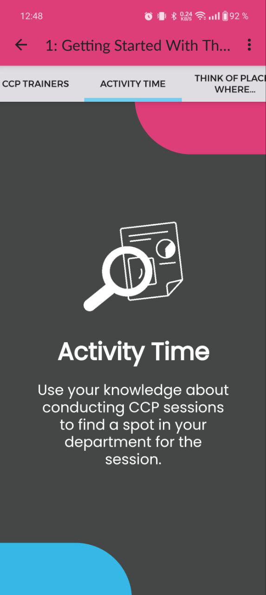
