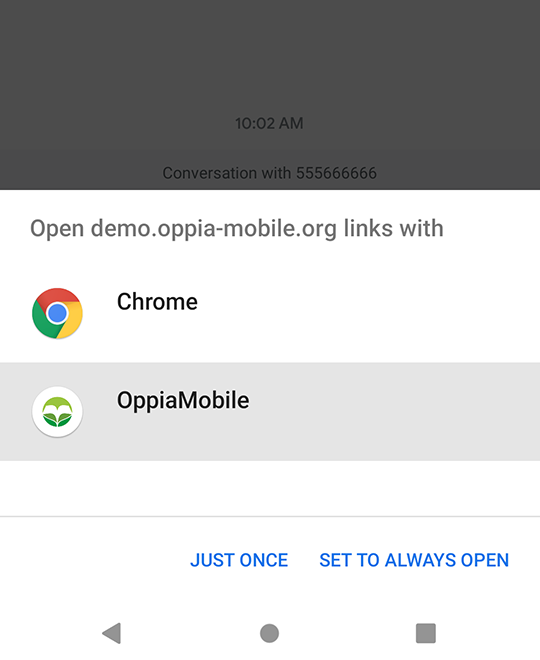
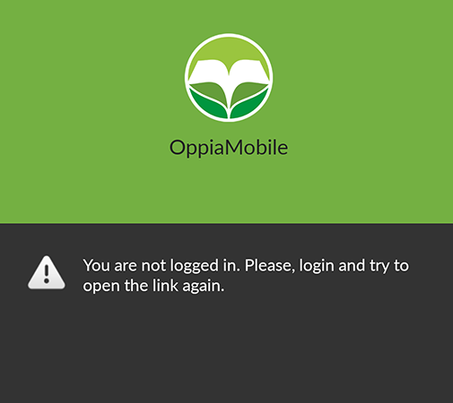
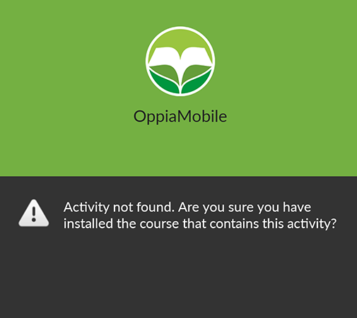
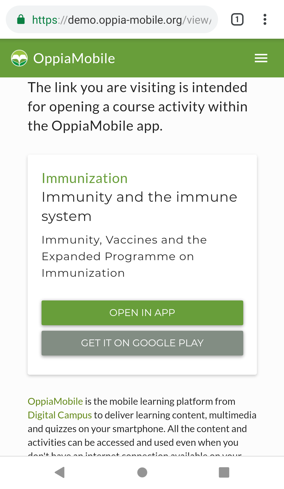

Launching OppiaMobile from other applications
==========================================================

	
In order to allow other applications to launch specific activities in the
OppiaMobile app, this can be done by using a standard weblink. 

The main use-cases for this functionality are:

* data collection or other support tools needing to link directly to refresher
  information/activities
* being able to send via SMS, WhatsApp or similar a direct link to a specific
  activity

Using a link, rather than an Android intent, helps to direct the user to the 
activity online if the app is not installed.

The links used should be in the following format:

https://demo.oppia-mobile.org/view?digest=XXXXXXXXX

The digest is a unique identifier for the specific activity in OppiaMobile - 
these can be found in the module.xml of the course zip package.

Here is an example of a link appearing in a text message (of course this link
could also be in other apps):

As the app is registered to open these kinds of links, when the user click on digest URL, Android will prompt her for 
which app to open the link with. If the user select the OppiaMobile app it will directly load the activity, independently of
whether the user has an active internet connection or not. If there is no logged in user right now, it will show that information instead:

​If the course that contains the activity is not installed in the device, the app won't find the activity by its digest, 
and it will show the message:

If the user selects to open the digest link with the Chrome browser, the activity info will be shown. If the user clicks the "open in app"
button, the browser will try to open the app passing the activity digest info. If the user doesn't have the app installed, it will
redirect him to the Google Play store page for the app.

For the browser option, the user needs an active internet connection on the device. Without it, the browser will just show a "No connection"
error as with any other web page.