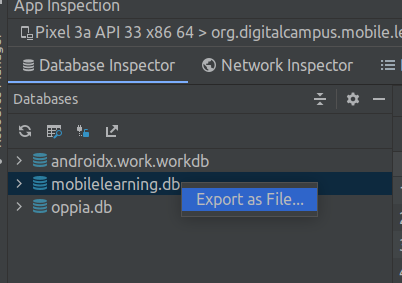
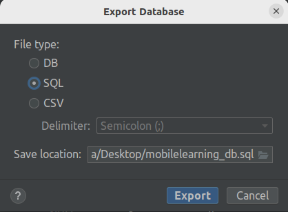

Extract app databases from device
=================================

To help with fixing bugs, there may be some times when accessing the actual
data in the local database for the device can be helpful. The steps below
describe how to get this data:

#. First of all, you'll need Android Studio version 4.2 or higher. Download the latest version for your 
operating system from the official page: https://developer.android.com/studio
#. Enable USB debugging on your phone/device (under Settings > System > Developer Options, you may need
to enable developer options first - see: https://android.tutorials.how/enable-developer-options/)
#. Connect the device to your computer and open the app
#. Under Android Studio, from the menu bar select View > Tool Windows > App Inspection.
#. Select the Database Inspector tab and then select device and the Oppia app running process from the menu
#. The databases in the currently running app appear in the Databases pane, you should be able to see at
least ``mobilelearning.db`` and ``oppia.db``

#. Right click in the ``mobilelearning.db`` database icon and select "Export as file"

#. In the dialog, select SQL as the file type, and click the export button.

Now, you have a backup of your app's current database state, that can be used to recreate
any ongoing issue by a developer.