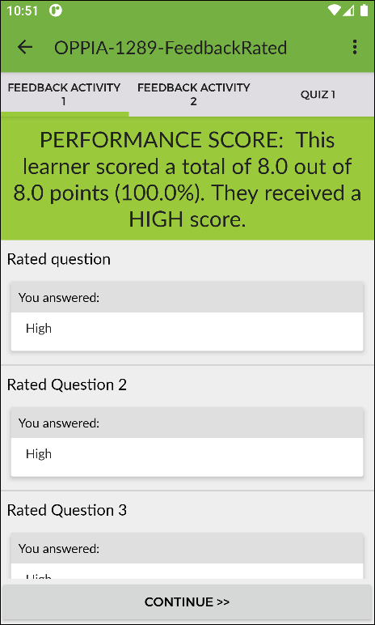
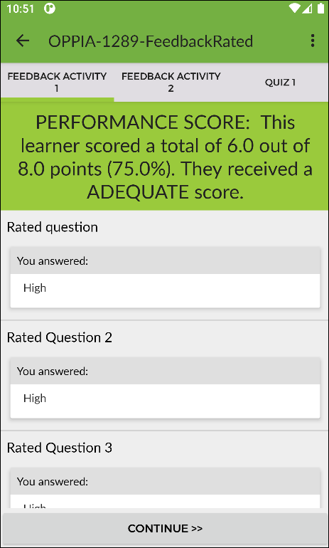
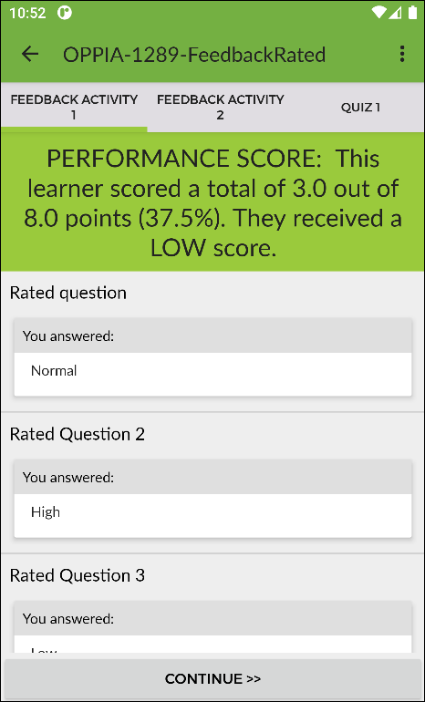

Export Step 2 - Quizzes and Feedback Configuration
=============================

Quizzes
~~~~~~~~

If your course has quizzes, then you will see a table of the quizzes with some
options to select:

#. **No random questions** - if you don't want all the questions to show to the
   user then select the number of questions that should be shown. They will
   appear in a random order, so don't use this if certain questions depend on
   information from previous questions or info.
#. **Show feedback** - when (if ever) should feedback about the users response
   be shown.
#. **Pass Threshold (%)** - what's the threshold (in percent) for the user to
   pass this quiz.
#. **Max number of attempts** - how many attempts can a user have at this quiz.

.. note::
   If the quiz is a pre-test, then only the **No random questions** option will
   be used, all other options will be ignored. The user will not receive any
   feedback for pre-test questions, there is no pass threshold and the user can
   only attempt the quiz once.

Feedback Activities
~~~~~~~~~~~~~~~~~~~~
If your course has feedback activities, you will see them listed in this page
with some options to configure:

Grade Boundaries
------------------

.. note::
   This functionality requires version 1.4.0 or higher of the Moodle Export Block
   and version v7.4.0 or higher of OppiaMobile App.

Each feedback activity that contains at least one question of type 'Multiple choice (rated)'
can be configured to display specific completion messages depending on the learner's final score
for that feedback activity.

**This is how it looks in Moodle:**

    .. image:: images/grade_boundaries_config_panel.png
        :align: center
        :width: 750

Some instructions on how to configure grade boundaries:

#. **Add extra rows using the** |add-row-button| **button.** The new row will be added between
   the rows where the button is located.
#. **Remove rows using the** |remove-row-button| **button.**
#. **Only the rows containing a message will be saved.** If you don't want to configure
   grade boundaries for a specific feedback activity, make sure all the rows for
   that feedback activity are completely empty.
#. The message of a row will be displayed if **the learner get a score greater
   or equals** than the grade indicated in the row.
#. **The order is important.** Grades should be set in descending order for each
   feedback activity.
#. **No duplicate grades.** There cannot be two or more rows with the same grade
   value for each feedback activity.
#. You can use the following **placeholders** that will be replace with the real
   value in the app:

   - **{{user_score}}** - Final score the learner obtained in the feedback activity.
   - **{{max_score}}** - Maximum score possible for the feedback activity.
   - **{{score_percentage}}** - Percentage value of the score the learner obtained.

   .. note::
      The double curly braces in placeholder names are important

**This is how it looks in the App:**

Considering the following grade boundaries table:

.. table::
   :widths: auto

   ========  =========
     Grade    Message
   ========  =========
   100%        PERFORMANCE SCORE: This learner scored a total of {{user_score}} out of {{max_score}} points ({{score_percentage}}%). They received a HIGH score.
   >= 50%      PERFORMANCE SCORE: This learner scored a total of {{user_score}} out of {{max_score}} points ({{score_percentage}}%). They received a ADEQUATE score.
   >= 0%       PERFORMANCE SCORE: This learner scored a total of {{user_score}} out of {{max_score}} points ({{score_percentage}}%). They received a LOW score.
   ========  =========

The following result will be shown in the app:

.. table::
   :widths: auto

   ============================  ==========================  ============================
     **Learner score = 100%**     **Learner score = 75%**      **Learner score = 37.5%**
   ============================  ==========================  ============================
            |high-score|              |adequate-score|                |low-score|
   ============================  ==========================  ============================

