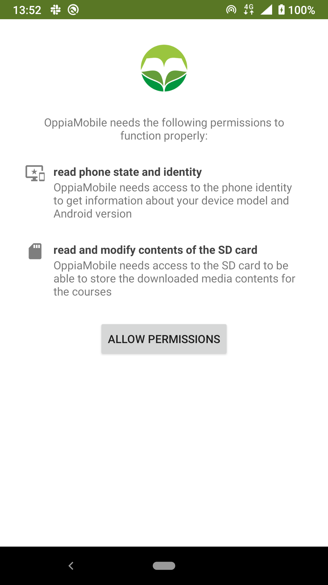
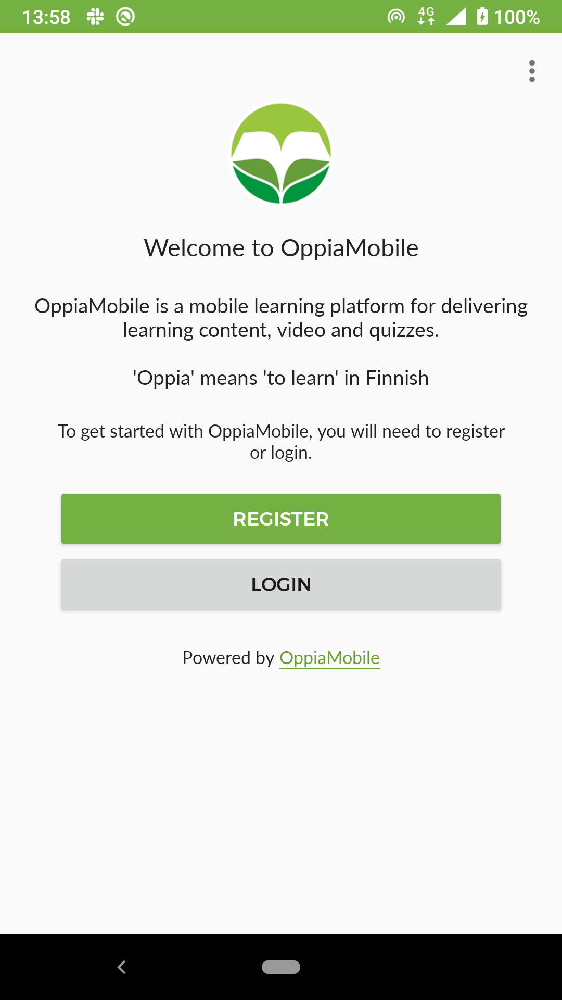
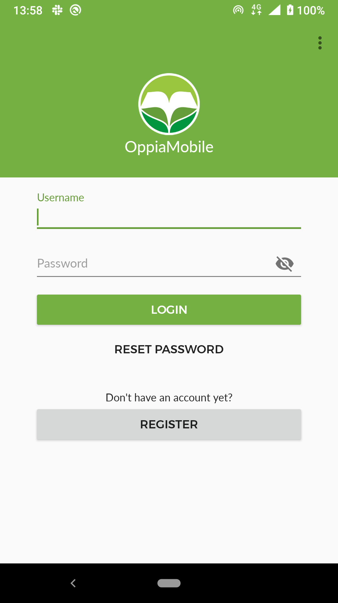
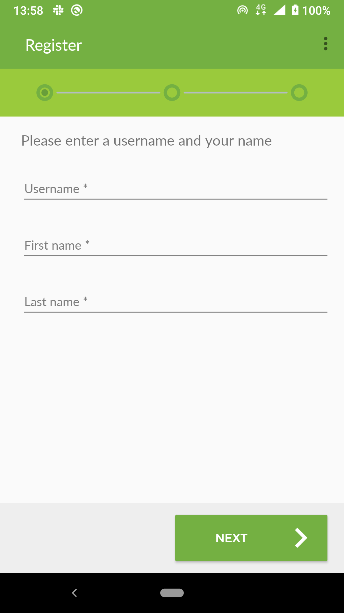
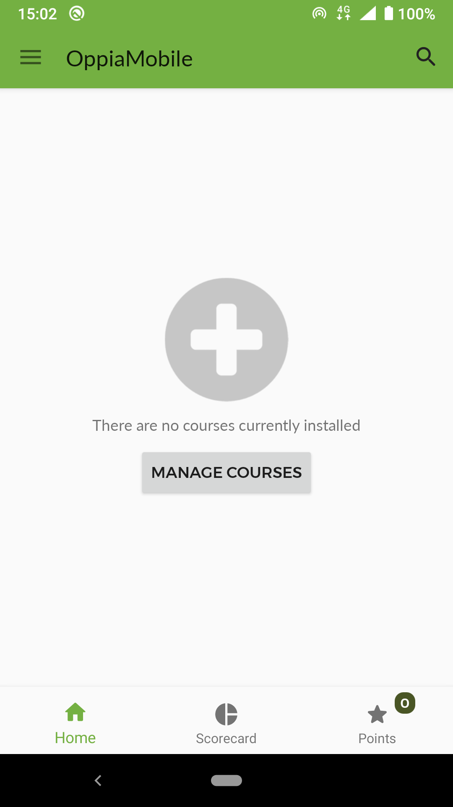
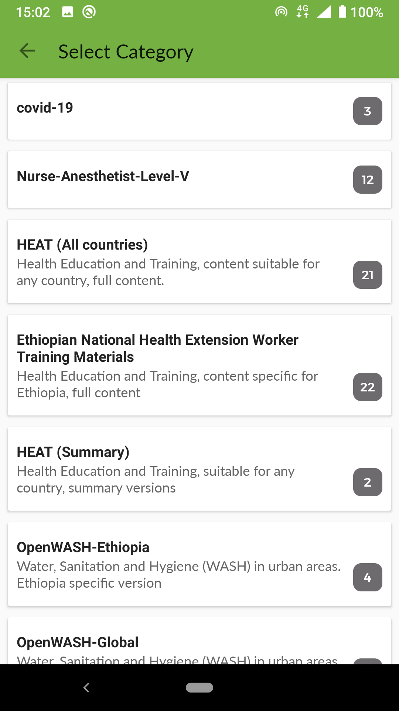
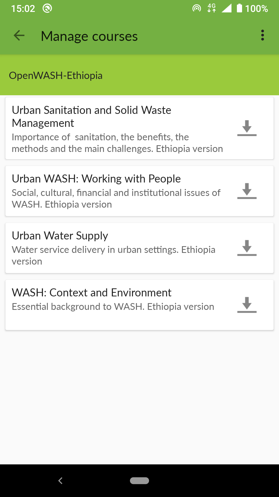
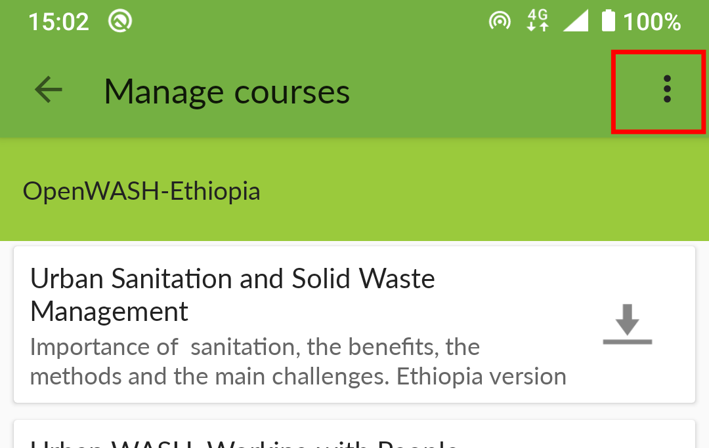
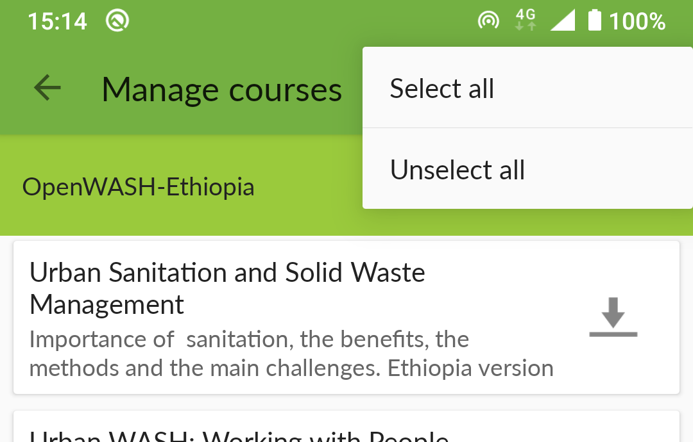

OppiaMobile App User Guide
=============================

This is a template user guide, based on the core Oppia app, which can be
adapted/edited to fit a particular implementation.

Introduction 
--------------

OppiaMobile is a mobile learning platform specifically designed for learners in
low connectivity environments. Course content can be accessed even when you are
offline, although initially you will need an internet connection to install the
app, register and get the courses.

Installing the app
-------------------

You can download the OppiaMobile app from the Google Play Store at:
https://play.google.com/store/apps/details?id=org.digitalcampus.mobile.learning

When you first open the OppiaMobile app, you will be asked to confirm the
following permissions:

* Read phone state and identity - this is to check the internet connectivity
  status
* Read and modify contents of the SD card - this is to be able to store the
  course contents locally on your phone

Please allow the OppiaMobile app access to both of these permissions, they are
required to ensure the app can function correctly.

Registering or Logging In
----------------------------

To use OppiaMobile you will need to either login or register.

If you already have an account, or a username/password has been given to you,
then please just press the button to login.

If you do not have an account, then please press the register button and 
complete the required information to create an account. The exact information
you need to register will depend on the specific implementation, and the
information they require for you to register.

Installing Courses 
-------------------------------

After logging in or registering, you will then need to download the courses to
access. When you have no courses installed, you will see this screen:

Click on the ``manage courses`` button to go through and select the courses you
would like to download. Course are divided into categories, so you can select
the appropriate category:

    
For example, selecting the ``OpenWASH - Ethiopia`` category, will then show you
the courses available:

    
You can then download each course separately, by clicking on the download icon
next to each course. Alternatively you can select all the courses to download 
from the menu button in the top right of the screen:

    

Installing Media
-------------------

Navigating Courses
---------------------

pre tests

Point and Badges
------------------

Changing your preferences
---------------------------

Course Updates
----------------

