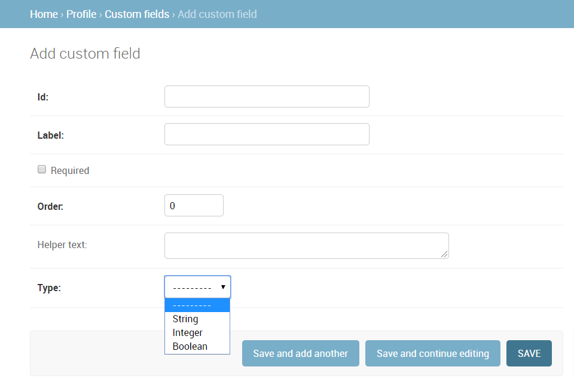
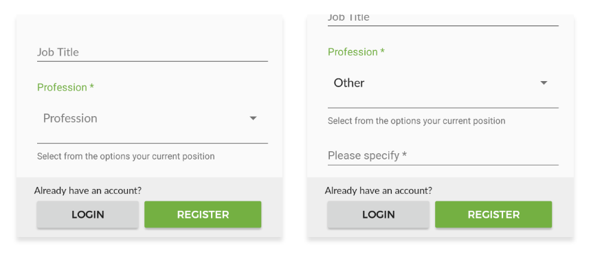

Adding extra registration form fields
=========================================

By default, OppiaMobile provides some basic user profile with some of the most
common fields needed for an implementation. This includes first name, last name,
email, or job title and organization the user belongs to. If there is a need to
have some additional fields, there is a simple way to customize them.

The system allows the definition of three custom field types:

* **String** values: for any kind of text form
* **Integer** values, for numerical fields
* **Boolean** values, for yes/no conditions, or a simple "License agreement",
  for example.

Server
-------

The profile custom fields can be edited dynamically from the user interface, so
there is no change in configuration files needed. 

This is done using the Django admin, so access it from the navigation bar (you
have to be a user with admin rights) and go to the "Profile > Custom fields" 
ection. There you can edit the current ones, remove them or add new fields.

* The **Id** field is the dictionary identifier for that field. Name it using
  the `snake_case` style, so for example, if you want to add a "Twitter
  username" field, you would name it `twitter_profile`. 
* The **"helper text"** field is used to define a explanatory text for that
  field that will be displayed on the form below the input.
* The **order** value is used to control how the custom fields are ordered
  within the form.

Be careful with adding additional required fields for apps already deployed,
since that could cause that a version of the app that doesn't include that
field in the registration form would not be able to submit new users, as the
form would not be validated because of that missing field.

App
----

Once the server is ready to manage the custom fields, we need to configure them
in the app. Right now this is done in the building process, so there is no way
of dynamically edit the form fields once the app has been built. In future 
ersions of the app, the custom fields definition will be directly fetched from
the server, but this process is needed anyway for a first definition and in
cases where the app will work mostly offline.

The custom fields are defined in a file named `custom_fields.json` under the
`assets` folder. You have to update this dictionary with the proper syntax.
Here is an example of how that JSON would look like (reading the description of
server custom fields the example itself is pretty much self-explanatory): ::

	{
		"fields": [
			{
				"name":"custom_text",
				"label":"Required field",
				"order":1,
				"required":true,
				"helper_text":"....",
				"type":"str"
			},
	
			{
				"name":"custom_bool",
				"label":"Boolean field",
				"order":2,
				"required":false,
				"helper_text":"Check this to field",
				"type":"bool"
			},
	
			{
				"name":"custom_int",
				"label":"Numeric field",
				"order":3,
				"required":false,
				"helper_text":"....",
				"type":"int"
			}
	
			// ... 
	
		]
	}

The custom fields are loaded once per app version, so if you want to update the
custom fields definition of a previously installed app, you'll have to update
the `LOAD_CUSTOMFIELDS_VERSION` build setting (see :doc:`./app/settings`) to a
higher value. If the value is the same of the current app version, you'll need
to update also your app `versionCode` in Gradle for this changes to be
reflected.

Note that the custom fields defined in the JSON will not add new fields defined
but **override** the current definition with that one, so any field that is no
longer there will be removed. This does not include the current values saved
for the local users of the app, only the definition of what fields appear in
the UI, so those values would be kept in the local database.

Choices field
^^^^^^^^^^^^^^^^^^

Additionally to the fields definition, you can configure a special kind of 
field where you only let the user select the value from a dropdown list of 
choices. Currently this is definition is not included in the server, so 
server-side it will be saved as a normal string value of the selected option. 
To do so, you need to set the field type to `choices`, and associate it with a 
collection defined in the `collections` section of the JSON dictionary.

Here is an example of how that JSON would look like: ::

	{
		"fields": [
			{
				"name":"custom_choice",
				"label":"Custom choice",
				"order":1,
				"required":true,
				"type":"choices",
				"collection":"choicelist"
			}
		],

		"collections": [
		    {
		      "collection_name": "choicelist",
		      "items":[
		        {"id": "choice1", "value":"Choice 1"},
		        {"id": "choice2", "value":"Choice 2"},
		        {"id": "choice3", "value":"Choice 3"},
		        ...
		      ]
		    }
		]
	}

Conditional fields
^^^^^^^^^^^^^^^^^^

You can also configure the visibility of a field to be dependant of another 
field in the registration form. This is done adding a property named 
`visible_byfield` in the field definition under the JSON, setting the value as the
name of the field it has the dependency on (`name` property in the field definition).

This will apply the following logic:

* If the field you have the condition by is a boolean field, the visibility 
  will be directly controlled by the checked status of that field

* If the dependent field is a choices field, the field will be visible whenever
  an option is selected. If you want to configure the field so that it only gets
  visible by a single value of the field's dropdown, you can add the 
  `visible_byvalue` property in the field definition, referencing the `id` of 
  that collection item. Let's see it with an example: ::
  
	{
		"fields": [
			{
				"name":"profession",
				"label":"Profession",
				"order":1,
				"required":true,
				"helper_text":"Select from the options your current position",
				"type":"choices",
				"collection":"professions"
			},
	
			{
				"name":"custom_job",
				"label":"Please specify",
				"order":2,
				"required":true,
				"visible_byfield":"profession",
				"visible_byvalue":"other",
				"type":"str"
			}
		],

		"collections": [
		    {
		      "collection_name": "professions",
		      "items":[
		        {"id": "hew", "value":"Health Extension Worker"},
		        {"id": "program_manager", "value":"Program manager or implementer"},
		        {"id": "research", "value":"Researcher"},
		        {"id": "n_a", "value":"N/A - Not currently working"},
		        {"id": "other", "value":"Other"}
		      ]
		    }
		]
	}

With this definition, the registration form will show a custom dropdown field 
to select the profession, and only in the case where the user selects the 
"Other" option the second field will become visible. Also, regarding the 
"required" property of the field, this is only checked if the field is 
currently visible.

Nested choice fields
^^^^^^^^^^^^^^^^^^^^^^^^^^^^^^^^

Regarding the choice fields, there are some use cases where there is the need 
to be able to show a different subset of choices depending on the value of
another field, for example, a county-district hierarchy. This is done adding 
a property named `collection_byfield` in the field definition under the JSON, 
setting the value as the name of the field it has the dependency on. 

Make sure that the field you reference is a `choices` type field, and then, 
for every option of that field's collection, there should be another collection
defined with the `collection_name` set as the `id` of that field.

Let's see it with an example: ::
  
	{
		"fields": [
			{
				"name":"parent",
				"label":"Parent field",
				"order":1,
				"required":true,
				"type":"choices",
				"collection":"parent"
			},
	
			{
				"name":"nested",
				"label":"Child field",
				"order":2,
				"required":true,
				"visible_byfield":"parent",
				"collection_byfield":"parent",
				"type":"choices"
			}
		],

		"collections": [
		    {
		      "collection_name": "parent",
		      "items":[
		        {"id": "first_child", "value":"Parent #1"},
		        {"id": "second_child", "value":"Parent #2"},
		        {"id": "third_child", "value":"Parent #3"}
		      ]
		    },

		    {
		      "collection_name": "first_child",
		      "items":[
		        {"id": "01", "value":"Parent #1 - Child #1"},
		        {"id": "02", "value":"Parent #1 - Child #2"},
		        {"id": "03", "value":"Parent #1 - Child #3"}
		      ]
		    },

		    {
		      "collection_name": "second_child",
		      "items":[
		        {"id": "01", "value":"Parent #2 - Child #1"},
		        {"id": "02", "value":"Parent #2 - Child #2"},
		        {"id": "03", "value":"Parent #2 - Child #3"}
		      ]
		    },

		    {
		      "collection_name": "third_child",
		      "items":[
		        {"id": "01", "value":"Parent #3 - Child #1"},
		        {"id": "02", "value":"Parent #3 - Child #2"},
		        {"id": "03", "value":"Parent #3 - Child #3"}
		      ]
		    }
		]
	}
