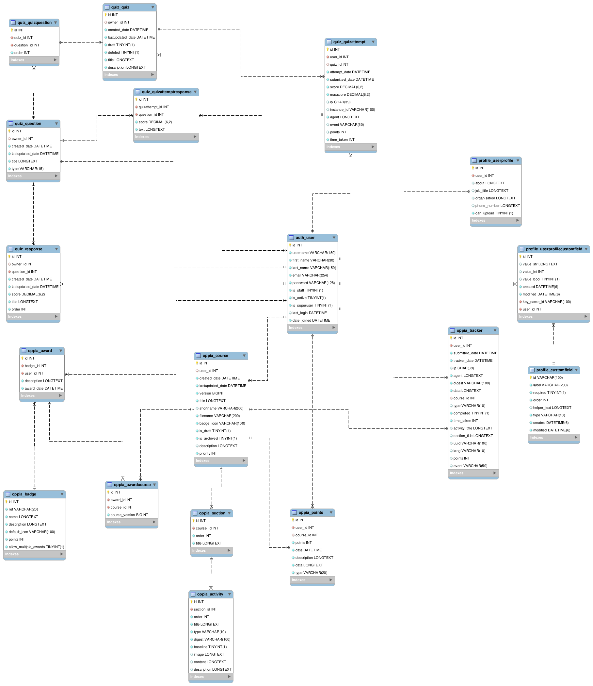

OppiaMobile Server Data Structure
=====================================

The basic data structure (entity relationshop diagram) of the OppiaMobile
server database is shown in the diagram below (click to view a larger version):

.. note::
   The tables shown here are the one most likley to be useful for extracting
   data about users activity within courses etc. It does not include all the
   tables that are in the database, there are many 'administration' type tables
   that are not shown. 

.. toctree::
   :maxdepth: 2
   
   tables
   
 
.. toctree::
   :maxdepth: 2
   
   queries
 