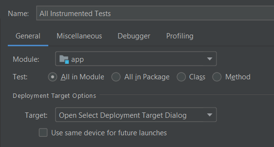
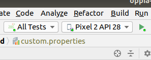

Running Tests for OppiaMobile App
=====================================

Initial Set Up
----------------

The first time the tests are run, there is some initial configuration that 
needs to be done:

1. Create debug configuration
~~~~~~~~~~~~~~~~~~~~~~~~~~~~~~

We can create a new debug configuration to run all the instrumented tests 
within the project. To do so, select the "Edit configurations" dropdown option, 
and add a new configuration of type "Android Instrumented tests".

In this new configuration, select to run all tests in Module and pick the `app` 
module.

After this, we can select this configuration and run in it in our chosen 
device.

2. Create Android Virtual Device (AVD)
~~~~~~~~~~~~~~~~~~~~~~~~~~~~~~~~~~~~~~~

If you don't have an AVD set up already, you can set one up using the 
instructions here: `Create and manage virtual devices 
<https://developer.android.com/studio/run/managing-avds>`_

Alternatively, you can use a physical device connected to your computer.

3. Create user account
~~~~~~~~~~~~~~~~~~~~~~

One specific test (``changeActivityWhenTheCredentialsAreCorrect`` in UI -> 
LoginUITest.java) requires a valid server and user account to test against, 
otherwise it will fail.

There are different ways to configure this:

* Set a valid server in the app custom.properties file; or:
* Install the app on the test device (AVD or physical device), then edit the 
  server name in the settings
  
Next:

* Create an account on the server that will be connected to with username 
  ``valid_username`` and password ``valid_password``; or
* Edit the code to replace ``valid_username`` and ``valid_password`` to be an 
  actual username and password for this server

Running All Tests
--------------------

To run all the tests, firstly select the 'All Tests' configuration you set up 
(above), then select the device to test on (eg your AVD or physical device), 
then select the green 'run' arrow, eg:

Running Specific Tests
--------------------------

We have several ways to run tests:

* **Run a single test**:
 
 First, open the class where the test is located, and then right-click the test 
 and click **Run**.

* **Run all tests in a class**:

 Right-click the class you want to test and click **Run**.

* **Run all test classes in a directory**:

 Right-click the directory you want to test and click **Run tests**.

* **Run tests using a test suite**:

 A test suite allows us to run a collection of test that we want. 

 To create a test suite, we need to create a new class and add these tags to 
 the beginning of it:

 .. code-block:: text
  
	  @RunWith(Suite.class)
	  @Suite.SuiteClasses({WelcomeUITest.class, LoginUITest.class, 
	  						RegisterUITest.class, ResetUITest.class})
	
	  public class UITestSuite {…}

 If we run this suite, the tests inside in the classes listed in 
 ``@Suite.SuiteClasses()`` will be executed.
